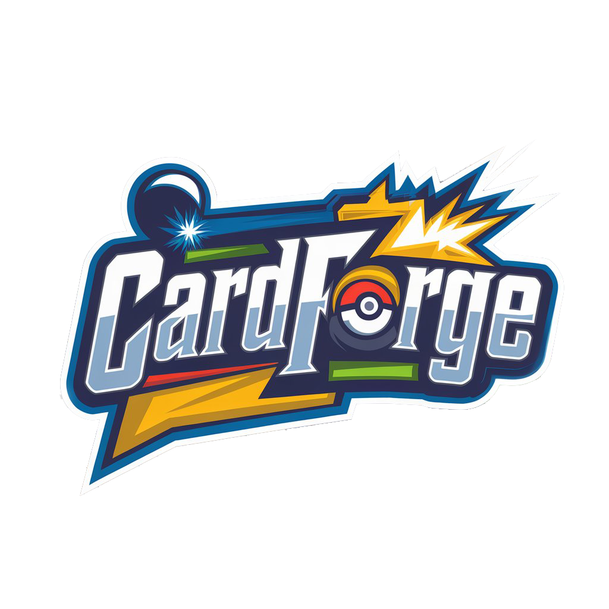

<h1>
    
    <h1>CardForge - Projeto</h1>
</h1>

📕 Sobre
Este projeto foi desenvolvido como parte de um desafio para ingresso em na fábrica de software 2025.1. O CardForge é um site interativo que permite aos usuários sortear cartas aleatórias de Pokémon TCG, proporcionando uma experiência dinâmica e divertida.

🛠 Tecnologias
Next.js 15.1.17
React 19.0
Swiper 11.2.4
TailWind 3.4.1
The PokemonTCG API

Como utilizar
   $ git clone https://github.com/rcgouveia/workshop-frontend-2025.1

   $ npm install

   $ cd cardforge

   $ npm run dev 

🧾 License
MIT License

Copyright (c) 2025 [Seu Nome]

Permission is hereby granted, free of charge, to any person obtaining a copy
of this software and associated documentation files (the "Software"), to deal
in the Software without restriction, including without limitation the rights
to use, copy, modify, merge, publish, distribute, sublicense, and/or sell
copies of the Software, and to permit persons to whom the Software is
furnished to do so, subject to the following conditions:

The above copyright notice and this permission notice shall be included in all
copies or substantial portions of the Software.

THE SOFTWARE IS PROVIDED "AS IS", WITHOUT WARRANTY OF ANY KIND, EXPRESS OR
IMPLIED, INCLUDING BUT NOT LIMITED TO THE WARRANTIES OF MERCHANTABILITY,
FITNESS FOR A PARTICULAR PURPOSE AND NONINFRINGEMENT. IN NO EVENT SHALL THE
AUTHORS OR COPYRIGHT HOLDERS BE LIABLE FOR ANY CLAIM, DAMAGES OR OTHER
LIABILITY, WHETHER IN AN ACTION OF CONTRACT, TORT OR OTHERWISE, ARISING FROM,
OUT OF OR IN CONNECTION WITH THE SOFTWARE OR THE USE OR OTHER DEALINGS IN
THE SOFTWARE.